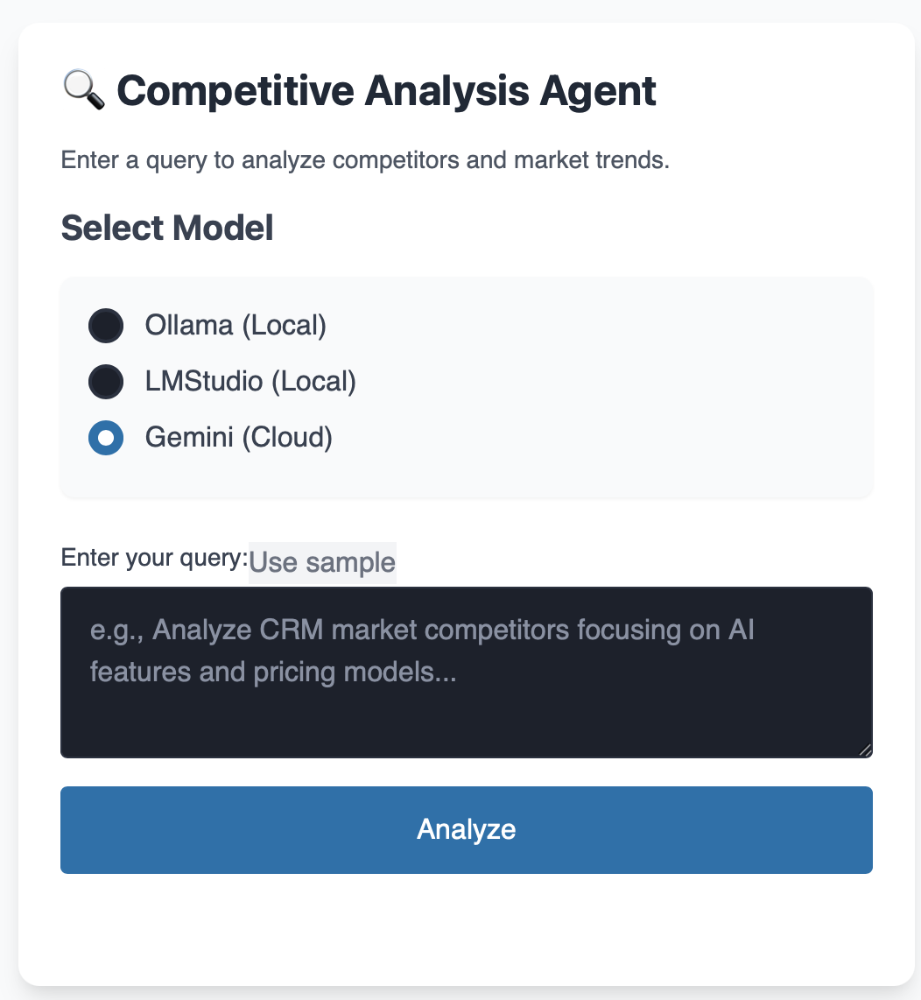

# AI PM Assistant

[](https://fastapi.tiangolo.com/)
[](https://fastht.ml/)
[](https://htmx.org/)
[](https://www.python-httpx.org/)
[](https://docs.aiohttp.org/en/stable/)
[](https://pydantic-docs.github.io/pydantic/)
[](https://pydantic-docs.github.io/pydantic-settings/)
[](https://developers.google.com/identity/protocols/oauth2)
[](https://www.starlette.io/)
[](https://jinja.palletsprojects.com/en/3.1.x/)
[](https://docs.pytest.org/en/7.4.x/)
[](https://github.com/pytest-dev/pytest-asyncio)
[](https://github.com/pytest-dev/pytest-mock)
[](https://mypy.readthedocs.io/en/stable/)

An AI-Powered Product Management Assistant designed to leverage Large Language Models (LLMs) for various product management tasks. Currently, the primary focus is on providing structured competitive analysis insights using multiple LLM backends.

The application is built with a focus on modularity, maintainability, and leveraging modern Python web technologies. It incorporates several best practices and optimizations implemented through recent refactoring efforts.



## Key Features (Implemented)

*   **Competitive Analysis Agent:** Leverages LLMs (Ollama, LMStudio, Gemini) to analyze user queries about competitors and market trends.
*   **Structured JSON Output:** Enforces reliable JSON output from LLMs matching predefined Pydantic schemas, ensuring data consistency.
*   **Multi-LLM Support:** Easily switch between configured local (Ollama, LMStudio) and cloud (Gemini) models via the UI.
*   **Web Interface:** A simple, reactive UI built with FastHTML and HTMX, allowing users to select models, input queries, and view results.
*   **Asynchronous Loading:** Uses HTMX polling for a non-blocking user experience while waiting for LLM responses.
*   **Google OAuth Authentication:** Secure user login via Google accounts.
*   **Configuration Management:** Centralized configuration using `.env` files and Pydantic settings.
*   **Error Handling:** Robust global exception handling with user-friendly error pages (using Jinja2).
*   **Static Files:** Serves CSS locally.
*   **Type Hinting:** Improved type safety using Python type hints and custom stubs (`mypy` compatible).
*   **Testing:** Includes integration tests (`pytest`) and standalone API tests.

## Technology Stack

*   **Backend Framework:** [FastAPI](https://fastapi.tiangolo.com/)
*   **Frontend Rendering:** [FastHTML](https://fastht.ml/) (Server-side Python components)
*   **Frontend Interactivity:** [HTMX](https://htmx.org/)
*   **LLM Interaction:** Direct API calls (`httpx`, `aiohttp`)
*   **Data Validation/Structuring:** [Pydantic](https://docs.pydantic.dev/) V2
*   **Configuration:** [Pydantic-Settings](https://docs.pydantic.dev/latest/concepts/pydantic_settings/)
*   **Authentication:** Google OAuth2 (`httpx-oauth` or similar implicit dependency)
*   **Session Management:** Starlette `SessionMiddleware`
*   **Templating (Error Pages):** [Jinja2](https://jinja.palletsprojects.com/)
*   **Testing:** `pytest`, `pytest-asyncio`, `pytest-mock`, `TestClient`
*   **Type Checking:** `mypy` (with custom stubs)

## Project Structure

The project follows a modular structure to separate concerns:

```
.
├── agents/             # Logic for specific AI agents (e.g., market research)
├── api_tests/          # Standalone scripts for testing external APIs (LLMs)
├── config.py           # Pydantic settings management (loads .env)
├── integration_tests/  # Pytest integration/unit tests for the application
├── llm_client.py       # Generic client class for interacting with LLM APIs
├── schemas/            # Pydantic models defining data structures
├── static/             # Static files (CSS, JS)
├── templates/          # Jinja2 templates (e.g., for error pages)
├── main.py             # FastAPI application entry point, middleware, routing setup
├── auth.py             # Authentication routes and logic
├── dashboard.py        # Dashboard UI route
├── analysis.py         # Analysis endpoint routes (initiates agent tasks)
├── utils.py            # Utility functions (e.g., auth dependency)
├── requirements.txt    # Python dependencies
├── .env.example        # Example environment variables file
├── README.md           # This file
├── code_summary.md     # High-level code structure overview
└── ... (other config/stub files like mypy.ini, *.pyi)
```

For a more detailed breakdown, see `code_summary.md`.

## Setup and Installation

1.  **Clone the Repository:**
    ```bash
    git clone https://github.com/stephabauva/ai_pm_assistant.git
    cd ai_pm_assistant
    ```

2.  **Create and Activate a Virtual Environment:**
    ```bash
    python -m venv venv
    source venv/bin/activate  # On Windows use `venv\Scripts\activate`
    ```

3.  **Install Dependencies:**
    ```bash
    pip install -r requirements.txt
    ```

## Configuration (`.env` File)

Create a `.env` file in the project root by copying `.env.example` (if provided) or creating it manually. Add the following required and optional variables:

```dotenv
# ---- File: .env ----

# --- Web App ---
APP_HOST="localhost" # Optional, defaults to localhost
APP_PORT="5001"      # Optional, defaults to 5001
APP_BASE_URL="http://localhost:5001" # IMPORTANT: Must match Google OAuth Redirect URI EXACTLY
SESSION_SECRET_KEY="YOUR_VERY_STRONG_RANDOM_SECRET_KEY_HERE" # *** REQUIRED *** Generate a strong secret key

# --- Google OAuth ---
# REQUIRED for login functionality
GOOGLE_CLIENT_ID="YOUR_GOOGLE_CLIENT_ID.apps.googleusercontent.com"
GOOGLE_CLIENT_SECRET="YOUR_GOOGLE_CLIENT_SECRET"

# --- AI Keys & URLs ---
# At least one LLM provider needs to be configured

# Gemini (Optional, requires API Key)
GEMINI_API_KEY="YOUR_GEMINI_API_KEY" # Required if using Gemini model
GEMINI_MODEL="models/gemini-1.5-flash-latest" # Optional, defaults to this

# Ollama (Optional, requires Ollama running locally)
OLLAMA_URL="http://localhost:11434" # Optional, defaults to this (ensure no trailing slash)
OLLAMA_MODEL="llama3" # Optional, defaults to llama3 (e.g., use phi3, mistral)

# LMStudio (Optional, requires LMStudio running locally)
LMSTUDIO_URL="http://localhost:1234/v1" # Optional, defaults to this (ensure OpenAI compatible endpoint, no trailing slash)
LMSTUDIO_MODEL="QuantFactory/Meta-Llama-3-8B-Instruct-GGUF" # *** REQUIRED if using LMStudio *** - Set to your loaded model identifier

# --- Redis (Currently Unused but Configurable) ---
# REDIS_HOST="localhost"
# REDIS_PORT="6379"
# REDIS_DB="0"

```

**IMPORTANT:**
*   Never commit your actual `.env` file to version control. Add `.env` to your `.gitignore` file.
*   Generate a strong, random `SESSION_SECRET_KEY`.
*   Ensure `APP_BASE_URL` matches the Redirect URI configured in your Google Cloud Console OAuth credentials.

## Running the Application

1.  Ensure your chosen local LLM servers (Ollama, LMStudio) are running if you intend to use them.
2.  Make sure all required environment variables are set in your `.env` file.
3.  Run the FastAPI application using Uvicorn:
    ```bash
    python main.py
    ```
4.  Access the application in your browser, typically at `http://localhost:5001`.

## Running Tests

### Integration Tests

These tests cover the application's internal logic, routes, and agent functionality using `pytest`. External API calls are mocked.

1.  Navigate to the project root directory.
2.  Run the tests:
    ```bash
    python -m pytest integration_tests
    ```
    Or:
    ```bash
    cd integration_tests
    pytest
    ```
3.  Refer to `integration_tests/integration_tests_usage.md` for more details.

### API Tests

These are standalone scripts for directly testing the external LLM APIs. They require the respective services (Ollama, Gemini API Key) to be available.

1.  Navigate to the `api_tests` directory.
2.  Run specific tests, e.g.:
    ```bash
    python test_ollama.py
    python test_gemini.py
    ```
3.  Refer to `api_tests/tests_usage.md` for prerequisites and usage details.

## Key Architectural Decisions & Improvements

This codebase reflects several deliberate design choices and improvements:

*   **Robust LLM Interaction:** Moved away from fragile parsing hacks to requesting and validating structured JSON directly from LLMs.
*   **Modularity:** Separated concerns into distinct modules (`llm_client`, `agents`, `schemas`, `config`) for better organization and scalability.
*   **Centralized Configuration:** Uses `pydantic-settings` to manage all configuration from environment variables and `.env`, improving maintainability.
*   **Improved Async Handling:** Replaced fixed delays with HTMX polling for a more responsive loading state during LLM calls.
*   **Enhanced Error Handling:** Implemented global FastAPI exception handlers and Jinja2 templates for user-friendly error pages.
*   **Type Safety:** Added comprehensive type hints and configured `mypy` (with custom stubs) to catch errors early.
*   **Security Foundations:** Implemented basic security best practices like secure session cookie flags (configurable), secrets management, and route protection.
*   **Test Coverage:** Established integration tests (`pytest`) and API interaction tests.

## Future Enhancements (From PRD)

*   **Additional Agents:** Implement more specialized agents (e.g., Roadmap Planning, User Story Generation).
*   **Multi-Agent Collaboration:** Explore frameworks like LangGraph for orchestrating interactions between agents.
*   **Dynamic Product Strategy Document:** Automatically generate and update strategy documents based on agent insights.
*   **Team Collaboration Features:** Allow multiple users within shared workspaces.
*   **Advanced Analytics & Reporting:** Provide dashboards summarizing AI analysis.
*   **More Integrations:** Connect with tools like Jira, Notion, Zoom.

## License

MIT License


